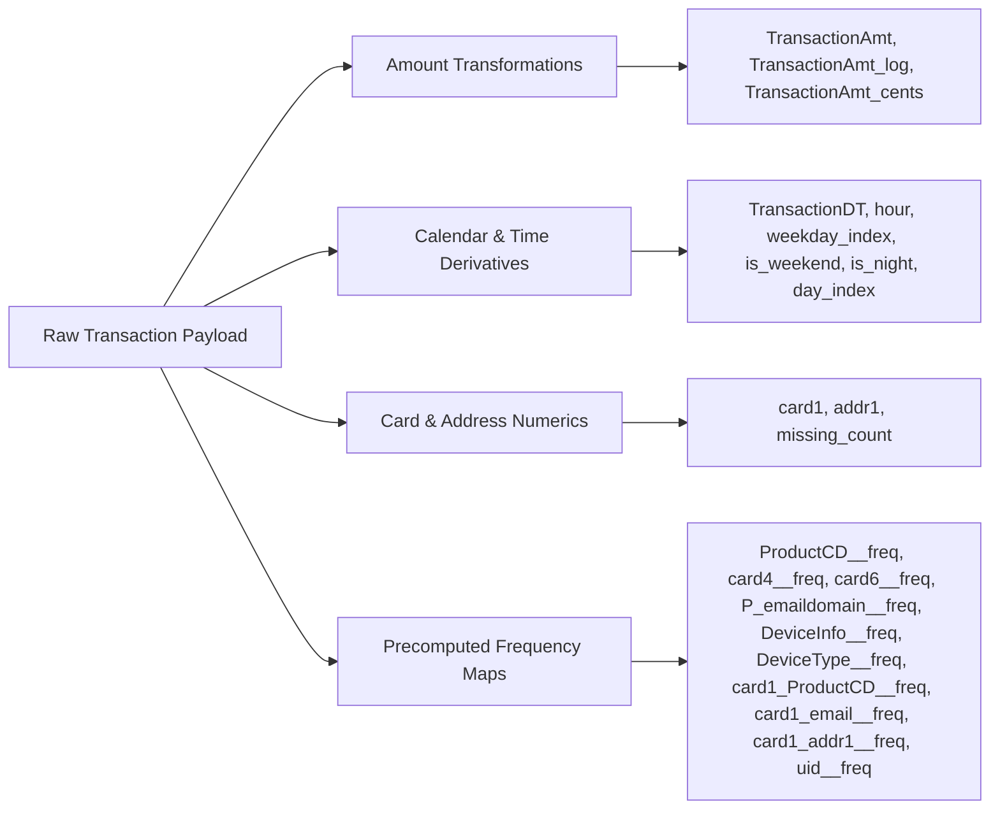
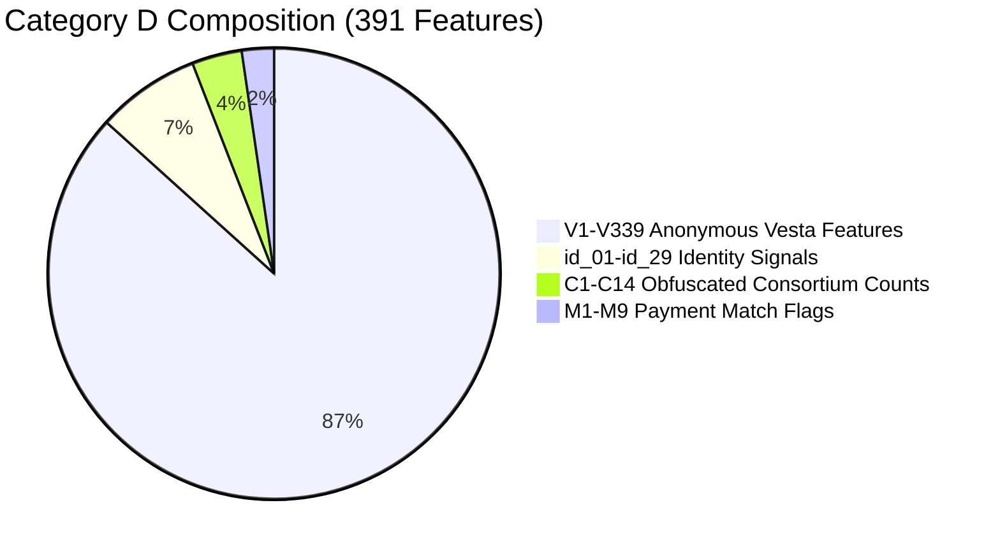
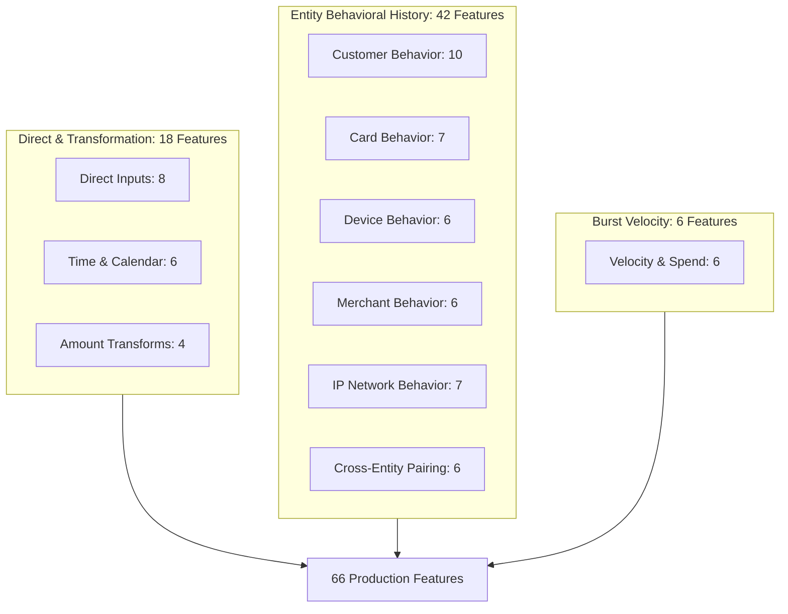

# AegisFin Phase 2: Live Feature Analysis & Production Feature Schema Design

**Author:** AegisFin Advanced AI Engineering Team  
**Date:** September 2026  
**Artifact Analyzed:** `models/aegisfin_phase2_fraud_champion.pkl`  
**Associated Outputs:**
- [phase2_feature_mapping.csv](file:///d:/AegisFin-AI_main_folder/AegisFin-AI-Phase1-Rich-Integration-Updated/AegisFin-AI-Phase1-Rich-Integration/docs/phase2_feature_mapping.csv)
- [phase2_live_feature_schema.json](file:///d:/AegisFin-AI_main_folder/AegisFin-AI-Phase1-Rich-Integration-Updated/AegisFin-AI-Phase1-Rich-Integration/docs/phase2_live_feature_schema.json)

---

## Executive Summary

AegisFin Phase 2 currently deploys an XGBoost champion model trained on the IEEE-CIS Fraud Detection benchmark dataset. The model artifact accepts a feature representation containing **459 features**. 

An in-depth audit reveals that **391 of the 459 features (85.19%) belong to Category D**—anonymous, proprietary Vesta V-features (`V1`–`V339`), unverified consortium counts (`C1`–`C14`), and obfuscated identity metrics. In the benchmark model, these Category D features account for **91.26% of cumulative tree importance**. Because live production transaction APIs cannot realistically obtain proprietary Vesta consortium data, the current inference pipeline fills them with static medians from training.

This analysis establishes the architectural foundation for a **second, deployment-compatible Phase 2 production fraud model schema**. This new schema:
1. **Completely eliminates** all 339 synthetic/median-imputed V-features.
2. **Standardizes 14 live input fields** supported by the frontend and FastAPI API.
3. **Defines 66 production candidate features** across 10 functional groups, combining direct transaction attributes with point-in-time Supabase entity behavioral history ($t < t_{\text{current}}$).
4. **Distinguishes** raw input fields from internal model features and human-interpretable risk signals.

---

## 1. Audit of the Current Champion Artifact

The champion model artifact `aegisfin_phase2_fraud_champion.pkl` is an `XGBClassifier` coupled with a Platt scaling `LogisticRegression` probability calibrator.

### 1.1 High-Level Feature Composition

| Feature Family | Count | % of Model Features | Description | Classification |
| :--- | :---: | :---: | :--- | :---: |
| **V-Features (`V1`–`V339`)** | 339 | 73.86% | Proprietary anonymous multi-entity consortium aggregates from Vesta | **Category D** |
| **Identity Features (`id_01`–`id_38`)** | 38 | 8.28% | Device, OS, and identity risk metrics from IEEE-CIS identity table | **Cat C / D** |
| **Categorical Frequency Maps (`__freq`)** | 35 | 7.63% | Frequency-encoded categories (cards, products, email, composites) | **Cat A / C / D** |
| **D-Timedeltas (`D1`–`D15`)** | 15 | 3.27% | Days elapsed since reference events (card issue, account open) | **Category C** |
| **Historical Anti-Leakage Features** | 15 | 3.27% | Customer and Card historical transaction count, mean, std, ratio | **Category B** |
| **C-Consortium Counts (`C1`–`C14`)** | 14 | 3.05% | Anonymous count variables across undisclosed payment networks | **Category D** |
| **Amount & Temporal Features** | 11 | 2.40% | TransactionAmt, hour, weekday, weekend, night, log, cents | **Category A** |
| **Match Indicators (`M1`–`M9`)** | 9 | 1.96% | AVS/cardholder name and address verification match flags | **Category D** |
| **Secondary Identifiers** | 7 | 1.53% | `card1`–`card5`, `addr1`–`addr2`, `dist1`–`dist2`, `missing_count` | **Cat A / C** |
| **Total Features** | **459** | **100.0%** | **Complete Champion Feature Space** | — |

### 1.2 Feature Importance & Category Breakdown

Audit execution on the saved XGBoost tree structure yielded the following distribution:

```
============================================================
CHAMPION MODEL FEATURE AUDIT SUMMARY (459 FEATURES)
============================================================
Category A (Direct Live Inputs):      22 features ( 4.79%) | Cumulative Importance:  3.08%
Category B (Derivable History):       15 features ( 3.27%) | Cumulative Importance:  1.37%
Category C (Future Upstream Fields):  31 features ( 6.75%) | Cumulative Importance:  4.29%
Category D (Impossible/Unreliable):  391 features (85.19%) | Cumulative Importance: 91.26%
------------------------------------------------------------
Total Features Audited:              459 features (100.0%) | Cumulative Importance: 100.0%
============================================================
```

### 1.3 Top Benchmark Features by Importance

The top 20 most important features in the benchmark tree model:

| Rank | Feature Name | Tree Importance | Importance % | Category | Live Production Feasibility |
| :---: | :--- | :---: | :---: | :---: | :--- |
| 1 | `V70` | 0.101234 | 10.12% | **D** | ❌ Impossible — Obfuscated Vesta aggregate |
| 2 | `V258` | 0.100250 | 10.02% | **D** | ❌ Impossible — Obfuscated Vesta aggregate |
| 3 | `V257` | 0.086651 | 8.67% | **D** | ❌ Impossible — Obfuscated Vesta aggregate |
| 4 | `V91` | 0.053535 | 5.35% | **D** | ❌ Impossible — Obfuscated Vesta aggregate |
| 5 | `V201` | 0.023051 | 2.31% | **D** | ❌ Impossible — Obfuscated Vesta aggregate |
| 6 | `V294` | 0.021993 | 2.20% | **D** | ❌ Impossible — Obfuscated Vesta aggregate |
| 7 | `V295` | 0.020172 | 2.02% | **D** | ❌ Impossible — Obfuscated Vesta aggregate |
| 8 | `C8` | 0.010040 | 1.00% | **D** | ❌ Unreliable — Anonymous count variable |
| 9 | `id_17` | 0.008117 | 0.81% | **D** | ❌ Impossible — Obfuscated identity metric |
| 10 | `V187` | 0.007514 | 0.75% | **D** | ❌ Impossible — Obfuscated Vesta aggregate |
| 11 | `C5` | 0.007168 | 0.72% | **D** | ❌ Unreliable — Anonymous count variable |
| 12 | `V283` | 0.006297 | 0.63% | **D** | ❌ Impossible — Obfuscated Vesta aggregate |
| 13 | `V308` | 0.006110 | 0.61% | **D** | ❌ Impossible — Obfuscated Vesta aggregate |
| 14 | `C14` | 0.006066 | 0.61% | **D** | ❌ Unreliable — Anonymous count variable |
| 15 | `V199` | 0.006001 | 0.60% | **D** | ❌ Impossible — Obfuscated Vesta aggregate |
| 16 | `V174` | 0.005547 | 0.55% | **D** | ❌ Impossible — Obfuscated Vesta aggregate |
| 17 | `card6__freq` | 0.005197 | 0.52% | **A** | ✅ **Available** — Card type (debit/credit) |
| 18 | `V269` | 0.004772 | 0.48% | **D** | ❌ Impossible — Obfuscated Vesta aggregate |
| 19 | `V34` | 0.004502 | 0.45% | **D** | ❌ Impossible — Obfuscated Vesta aggregate |
| 20 | `V336` | 0.004477 | 0.45% | **D** | ❌ Impossible — Obfuscated Vesta aggregate |

> [!WARNING]
> **Over 91% of tree importance in the benchmark model relies on unobservable Category D features.**
> Relying on training-set medians for 391 features during live inference introduces severe bias and degrades real-time responsiveness. A production model must be trained on authentic features.

---

## 2. Current AegisFin Live Input Schema

Inspection of `FraudPredictionRequest` in [`app/schemas.py`](file:///d:/AegisFin-AI_main_folder/AegisFin-AI-Phase1-Rich-Integration-Updated/AegisFin-AI-Phase1-Rich-Integration/app/schemas.py) and the Streamlit view in [`app/streamlit_fraud_view.py`](file:///d:/AegisFin-AI_main_folder/AegisFin-AI-Phase1-Rich-Integration-Updated/AegisFin-AI-Phase1-Rich-Integration/app/streamlit_fraud_view.py) confirms that AegisFin currently supports exactly **14 raw input fields**:

| # | Field Name | Data Type | Required | Streamlit Widget | Description |
| :---: | :--- | :---: | :---: | :--- | :--- |
| 1 | `transaction_id` | `str` | Yes | Text Input | Unique transaction reference string |
| 2 | `amount` | `float` | Yes | Number Input | Transaction amount in USD ($\ge 0.00$) |
| 3 | `transaction_timestamp` | `str` | Optional | Text Input (ISO-8601) | Event timestamp in UTC |
| 4 | `customer_id` | `str` | Yes | Text Input | Account holder / user unique ID |
| 5 | `card_id` | `str` | Yes | Text Input | Payment card identifier (maps to `card1`) |
| 6 | `device_id` | `str` | Optional | Text Input | Hardware fingerprint / device ID |
| 7 | `merchant_id` | `str` | Optional | Text Input | Merchant reference / store ID |
| 8 | `product_code` | `str` | Optional | Dropdown (`W,H,C,S,R`) | Transaction category |
| 9 | `card_network` | `str` | Optional | Dropdown (`visa,mastercard...`) | Card network scheme |
| 10 | `card_type` | `str` | Optional | Dropdown (`debit,credit`) | Card funding classification |
| 11 | `email_domain` | `str` | Optional | Text Input | Purchaser email domain (`gmail.com`) |
| 12 | `address_id` | `str` | Optional | Text Input | Billing zip / location ID (`addr1`) |
| 13 | `ip_address` | `str` | Optional | Text Input | Client IP address |
| 14 | `country` | `str` | Optional | Text Input | 2-letter ISO country code (`US`) |

No additional raw fields are currently collected or accepted by the production API.

---

## 3. Category A: Directly Available Live Features

Category A features are directly extracted or deterministically computed from the 14 raw transaction inputs without querying external databases.

There are **22 Category A features** in the benchmark model:



### Exact Mathematical Transformations for Category A

1. **Amount Transformations:**
   - $\text{TransactionAmt} = \text{amount}$
   - $\text{TransactionAmt\_log} = \ln(1 + \text{amount})$
   - $\text{TransactionAmt\_cents} = \text{amount} - \lfloor \text{amount} \rfloor$
2. **Temporal Transformations ($t = \text{transaction\_timestamp}$):**
   - $\text{TransactionDT} = \text{epoch\_seconds}(t)$
   - $\text{hour} = t.\text{hour} \in [0, 23]$
   - $\text{weekday\_index} = t.\text{weekday}() \in [0, 6]$
   - $\text{is\_weekend} = \mathbb{I}(t.\text{weekday}() \in \{5, 6\})$
   - $\text{is\_night} = \mathbb{I}(t.\text{hour} < 6)$
   - $\text{day\_index} = t.\text{day\_of\_year} \in [1, 366]$
3. **Identity & Categorical Mappings:**
   - $\text{card1} = \text{float}(\text{card\_id})$ (fallback: 9633.0)
   - $\text{addr1} = \text{float}(\text{address\_id})$ (fallback: 299.0)
   - $\text{missing\_count} = \sum_{k} \mathbb{I}(\text{input}_k \text{ is NULL})$
   - $\text{feature\_\_freq} = \text{FrequencyMap}[\text{raw\_value}]$

---

## 4. Category B: Derivable Historical Features

Category B features are computed dynamically from `public.fraud_transactions` and `public.fraud_entity_state`.

> [!IMPORTANT]
> **Strict Anti-Leakage Guarantee**
> All historical features are computed point-in-time:
> $$\text{Filter: } \text{transaction\_timestamp} < \text{current\_transaction\_timestamp}$$
> Future transactions ($t \ge t_{\text{curr}}$) and the current transaction itself are strictly excluded from history during both feature generation and model training.

### 4.1 Current Historical Features in Benchmark Model (15 features)
- **Customer (`uid`):** `uid_past_count`, `uid_past_mean_amt`, `uid_past_std_amt`, `uid_amount_ratio`, `uid_is_new`
- **Card (`card1`):** `card1_past_count`, `card1_past_mean_amt`, `card1_past_std_amt`, `card1_amount_ratio`, `card1_is_new`
- **Card + Address (`card1_addr1`):** `card1_addr1_past_count`, `card1_addr1_past_mean_amt`, `card1_addr1_past_std_amt`, `card1_addr1_amount_ratio`, `card1_addr1_is_new`

### 4.2 Proposed Production Behavioral Feature Suite

For the production model, we expand Category B to cover multi-window velocity, entity burst rates, and cross-entity association flags:

| Subgroup | Feature Name | Computation / Formula ($t < t_{\text{curr}}$) | Behavioral Rationale |
| :--- | :--- | :--- | :--- |
| **Customer** | `customer_tx_count_5m` | $\sum \mathbb{I}(t \in [t_{\text{curr}}-5\text{m}, t_{\text{curr}}))$ | Detects bot/scripted rapid transaction bursts |
| | `customer_tx_count_1h` | $\sum \mathbb{I}(t \in [t_{\text{curr}}-1\text{h}, t_{\text{curr}}))$ | Detects high-frequency intraday usage |
| | `customer_tx_count_24h` | $\sum \mathbb{I}(t \in [t_{\text{curr}}-24\text{h}, t_{\text{curr}}))$ | 24-hour daily transaction volume |
| | `customer_amount_mean` | $\mu = \frac{1}{N} \sum \text{amount}_i$ | Baseline spending behavior for account |
| | `customer_amount_std` | $\sigma = \sqrt{\frac{1}{N} \sum (\text{amount}_i - \mu)^2}$ | Standard deviation of customer transactions |
| | `customer_amount_zscore` | $Z = \frac{\text{amount} - \mu}{\sigma + 10^{-5}}$ | Standardized deviation score (> 3 is unusual) |
| | `customer_amount_ratio` | $R = \frac{\text{amount}}{\mu + 10^{-5}}$ | Multiplier against historical average spend |
| | `customer_is_new` | $\mathbb{I}(N == 0)$ | Flag for new account with zero prior history |
| | `customer_unique_merchants_24h` | $|\{m_i \mid t_i \in [t_{\text{curr}}-24\text{h}, t_{\text{curr}})\}|$ | Card-testing merchant hopping indicator |
| | `customer_unique_devices_24h` | $|\{d_i \mid t_i \in [t_{\text{curr}}-24\text{h}, t_{\text{curr}})\}|$ | Multi-device account takeover signal |
| **Card** | `card_tx_count_5m` | $\sum \mathbb{I}(t \in [t_{\text{curr}}-5\text{m}, t_{\text{curr}}))$ | Card-level velocity burst |
| | `card_tx_count_1h` | $\sum \mathbb{I}(t \in [t_{\text{curr}}-1\text{h}, t_{\text{curr}}))$ | Card 1-hour volume |
| | `card_tx_count_24h` | $\sum \mathbb{I}(t \in [t_{\text{curr}}-24\text{h}, t_{\text{curr}}))$ | Card daily frequency |
| | `card_amount_mean` | $\mu_{\text{card}}$ | Baseline card spend |
| | `card_amount_std` | $\sigma_{\text{card}}$ | Card spend volatility |
| | `card_amount_ratio` | $\text{amount} / (\mu_{\text{card}} + 10^{-5})$ | Card spend spike ratio |
| | `card_is_new` | $\mathbb{I}(N_{\text{card}} == 0)$ | First time this card is presented to platform |
| **Device** | `device_tx_count_5m` | $\sum \mathbb{I}(t \in [t_{\text{curr}}-5\text{m}, t_{\text{curr}}))$ | Hardware bot flood indicator |
| | `device_tx_count_1h` | $\sum \mathbb{I}(t \in [t_{\text{curr}}-1\text{h}, t_{\text{curr}}))$ | Hardware 1h volume |
| | `device_tx_count_24h` | $\sum \mathbb{I}(t \in [t_{\text{curr}}-24\text{h}, t_{\text{curr}}))$ | Hardware daily usage |
| | `device_unique_customers_24h` | $|\{c_i \mid \text{device}=\text{curr}, 24\text{h}\}|$ | Device shared across multiple customer accounts |
| | `device_unique_cards_24h` | $|\{\text{card}_i \mid \text{device}=\text{curr}, 24\text{h}\}|$ | Device used with multiple distinct credit cards |
| | `device_is_new` | $\mathbb{I}(N_{\text{dev}} == 0)$ | First time hardware fingerprint seen |
| **Merchant** | `merchant_tx_count_1h` | Merchant 1-hour volume | Merchant traffic volume |
| | `merchant_tx_count_24h` | Merchant 24-hour volume | Merchant daily traffic |
| | `merchant_amount_mean` | Historical average at merchant | Store average purchase size |
| | `merchant_amount_std` | Historical std at merchant | Store ticket size variance |
| | `customer_merchant_tx_count` | $\sum \mathbb{I}(c=\text{curr} \wedge m=\text{curr})$ | Prior relationship frequency |
| | `customer_merchant_is_new` | $\mathbb{I}(\text{count} == 0)$ | First time customer shops at this merchant |
| **IP** | `ip_tx_count_5m` | IP 5-minute transaction volume | Network botnet / brute-force blast |
| | `ip_tx_count_1h` | IP 1-hour transaction volume | Proxy / VPN burst activity |
| | `ip_tx_count_24h` | IP 24-hour transaction volume | IP daily activity |
| | `ip_unique_customers_24h` | $|\{c_i \mid \text{IP}=\text{curr}, 24\text{h}\}|$ | Many accounts from single IP (credential stuffing) |
| | `ip_unique_cards_24h` | $|\{\text{card}_i \mid \text{IP}=\text{curr}, 24\text{h}\}|$ | Multiple payment cards attempted from same IP |
| | `ip_unique_devices_24h` | $|\{\text{dev}_i \mid \text{IP}=\text{curr}, 24\text{h}\}|$ | Spoofed device fingerprinting behind single IP |
| | `ip_is_new` | $\mathbb{I}(N_{\text{ip}} == 0)$ | Unseen client IP address |
| **Cross-Entity** | `customer_device_seen_before` | $\mathbb{I}((c, d) \in \text{history})$ | Detects recognized hardware for customer |
| | `customer_card_seen_before` | $\mathbb{I}((c, \text{card}) \in \text{history})$ | Detects recognized payment method |
| | `customer_merchant_seen_before` | $\mathbb{I}((c, m) \in \text{history})$ | Repeat merchant interaction |
| | `customer_ip_seen_before` | $\mathbb{I}((c, \text{IP}) \in \text{history})$ | Familiar network location |
| | `card_device_seen_before` | $\mathbb{I}((\text{card}, d) \in \text{history})$ | Card previously authorized on this device |
| | `card_ip_seen_before` | $\mathbb{I}((\text{card}, \text{IP}) \in \text{history})$ | Card previously authorized from this IP |
| **Velocity** | `rapid_transaction_flag` | $\mathbb{I}(t_{\text{curr}} - t_{\text{last\_tx}} \le 60\text{s})$ | High-confidence carding bot attack signal |
| | `transactions_last_5m` | Cumulative 5m customer transactions | Burst transaction count |
| | `transactions_last_15m` | Cumulative 15m customer transactions | 15-minute burst window |
| | `transactions_last_1h` | Cumulative 1h customer transactions | Hourly pace |
| | `amount_sum_last_1h` | $\sum \text{amount}_i \in [t_{\text{curr}}-1\text{h}, t_{\text{curr}})$ | Rapid balance draining velocity |
| | `amount_sum_last_24h` | $\sum \text{amount}_i \in [t_{\text{curr}}-24\text{h}, t_{\text{curr}})$ | 24-hour total money movement |

---

## 5. Category C: Potentially Available Future Fields

Category C encompasses **31 features** in the benchmark model plus candidate production fields that could be integrated if AegisFin adds upstream data providers or client SDKs:

### 5.1 Upstream Enrichments & Future Schema Candidates

| Candidate Field | Acquisition Mechanism | Fraud Detection Utility |
| :--- | :--- | :--- |
| `currency` | Payment Gateway payload | Detects high-risk cross-border currency conversion |
| `transaction_channel` | API metadata (`WEB`, `MOBILE_APP`, `POS`, `API`) | Fraud rates vary by 10x between mobile biometric vs API |
| `merchant_category_code` (MCC) | Payment Gateway / ISO 8583 | MCC 6051 (quasi-cash), 7995 (betting), 5732 (electronics) are high risk |
| `payment_method` | Checkout form (`apple_pay`, `google_pay`, `manual_card`) | Tokenized biometric wallets have <0.02% fraud rates |
| `account_age_days` | Customer database (`users.created_at`) | Replaces IEEE-CIS `D1`; new accounts have 8x higher chargebacks |
| `card_age_days` | Card tokenization timestamp | Replaces IEEE-CIS `D2`; brand-new cards are higher risk |
| `billing_country` vs `shipping_country` | Checkout addresses | Mismatched destination country is a premier physical fraud signal |
| `ip_latitude`, `ip_longitude` | MaxMind GeoIP2 lookup | Enables geo-velocity calculation (impossible physical transit) |
| `browser_user_agent` | HTTP Request headers | Replaces `id_30`/`id_31` (OS & browser versions) |
| `3DS_result` | 3D Secure / CardinalCommerce | `Y` (authenticated), `A` (attempted), `N` (failed) |
| `failed_attempt_count` | Gateway decline logs in last 1h | Carding attack flag |
| `prior_chargeback_count` | Dispute management table | Direct historical recidivism indicator |
| `account_balance` | Core banking API | Large transactions draining >90% of liquid balance |

> [!NOTE]
> None of Category C fields are added to the active live UI or model yet. They are documented here to establish a roadmap for Phase 2 production model re-architecture.

---

## 6. Category D: Impossible / Unreliable Features

Category D contains **391 features** (85.19% of all benchmark columns) that cannot and should not be used in live production.



### Why V1–V339 Must NOT Be Used in Production

1. **Complete Proprietary Obfuscation:** The IEEE-CIS competition organizers (Vesta Corporation) engineered `V1` through `V339` as proprietary signals calculated across their internal private merchant network. Neither the formulas, nor the source tables, nor the units were ever released.
2. **Missing Upstream Source:** In any standalone deployment (AegisFin, bank, or payment processor), no upstream API can provide `V70 = 1.0` or `V258 = 2.0`. 
3. **Median Imputation Pathology:** Passing training median values (e.g. `V70 = 0.0`) to an XGBoost model means the trees branch on synthetic constants rather than live transaction signals.
4. **Zero Explainability:** Regulatory compliance (FCRA, GDPR Article 22, SR 11-7 model governance) prohibits making adverse financial decisions based on undocumented variables like `V258`.

---

## 7. Recommended Production Feature Candidate Set

The recommended production feature schema contains **66 defensible, reproducible features**:



### 10 Functional Groups Summary

1. **Direct Transaction Features (8):** `amount`, `product_code_freq`, `card_network_freq`, `card_type_freq`, `email_domain_freq`, `address_id_numeric`, `country_freq`, `missing_fields_count`.
2. **Time & Calendar Features (6):** `hour`, `weekday_index`, `is_weekend`, `is_night`, `day_of_year`, `time_since_midnight_sec`.
3. **Amount Transformation Features (4):** `amount_log`, `amount_cents`, `is_round_amount`, `is_zero_cents`.
4. **Customer Behavioral History (10):** `customer_tx_count_5m`, `customer_tx_count_1h`, `customer_tx_count_24h`, `customer_amount_mean`, `customer_amount_std`, `customer_amount_zscore`, `customer_amount_ratio`, `customer_is_new`, `customer_unique_merchants_24h`, `customer_unique_devices_24h`.
5. **Card Behavioral History (7):** `card_tx_count_5m`, `card_tx_count_1h`, `card_tx_count_24h`, `card_amount_mean`, `card_amount_std`, `card_amount_ratio`, `card_is_new`.
6. **Device Behavioral History (6):** `device_tx_count_5m`, `device_tx_count_1h`, `device_tx_count_24h`, `device_unique_customers_24h`, `device_unique_cards_24h`, `device_is_new`.
7. **Merchant Behavioral History (6):** `merchant_tx_count_1h`, `merchant_tx_count_24h`, `merchant_amount_mean`, `merchant_amount_std`, `customer_merchant_tx_count`, `customer_merchant_is_new`.
8. **IP Network Behavioral History (7):** `ip_tx_count_5m`, `ip_tx_count_1h`, `ip_tx_count_24h`, `ip_unique_customers_24h`, `ip_unique_cards_24h`, `ip_unique_devices_24h`, `ip_is_new`.
9. **Cross-Entity Pairing Features (6):** `customer_device_seen_before`, `customer_card_seen_before`, `customer_merchant_seen_before`, `customer_ip_seen_before`, `card_device_seen_before`, `card_ip_seen_before`.
10. **Velocity & Burst Features (6):** `rapid_transaction_flag`, `transactions_last_5m`, `transactions_last_15m`, `transactions_last_1h`, `amount_sum_last_1h`, `amount_sum_last_24h`.

---

## 8. Frontend Display vs. Internal Features vs. Risk Signals

A production fraud UI must never expose hundreds of raw model columns to fraud analysts or customers. The interface maintains a strict three-tier separation:

```
┌────────────────────────────────────────────────────────┐
│ 1. RAW INPUT FIELDS (14 User-Provided Form Fields)     │
│    Amount, Customer ID, Card ID, Device, IP, etc.      │
└──────────────────────────┬─────────────────────────────┘
                           │
                           ▼
┌────────────────────────────────────────────────────────┐
│ 2. MODEL FEATURES (66 Internal Numerical Features)     │
│    Log transforms, Supabase history, multi-window      │
│    velocities, frequency lookups, cross-entity flags    │
└──────────────────────────┬─────────────────────────────┘
                           │
                           ▼
┌────────────────────────────────────────────────────────┐
│ 3. HUMAN-READABLE RISK SIGNALS (8 Analyst Badges)      │
│    Highlighted on the UI when specific risks trigger    │
└────────────────────────────────────────────────────────┘
```

### Recommended Human-Readable Risk Signals

| Signal ID | Signal Name | Trigger Condition | Severity | Display Badge Text |
| :---: | :--- | :--- | :---: | :--- |
| `SIG_NEW_DEV` | **New Device Detected** | `device_is_new == 1` or `cust_dev_seen == 0` | 🟡 MEDIUM | First time this hardware fingerprint was used by customer |
| `SIG_NEW_IP` | **New IP Address** | `ip_is_new == 1` or `cust_ip_seen == 0` | 🟢 LOW | Transaction originated from a new IP network |
| `SIG_DEV_SHR` | **Device Shared by Multiple Users** | `device_unique_customers_24h >= 3` | 🔴 CRITICAL | Device used by 3+ distinct customer accounts within 24 hours |
| `SIG_IP_SHR` | **Card Testing IP Cluster** | `ip_unique_cards_24h >= 4` | 🔴 HIGH | 4+ distinct payment cards attempted from same IP in 24 hours |
| `SIG_AMT_DEV` | **Unusual Amount Deviation** | `customer_amount_zscore > 3.0` | 🔴 HIGH | Amount exceeds customer average by >3 standard deviations |
| `SIG_RAPID_TX`| **High Transaction Velocity** | `rapid_transaction_flag == 1` | 🔴 HIGH | Transaction initiated <60 seconds after prior transaction |
| `SIG_BURST_SP`| **Hourly Spend Surge** | `amount_sum_last_1h > $2,000` & $\mu < \$500$ | 🔴 HIGH | 1-hour cumulative spend exceeds $2,000 against low baseline |
| `SIG_NEW_MER` | **High-Value New Merchant** | `customer_merchant_is_new == 1` & $\text{amt} > \$500$ | 🟡 MEDIUM | First transaction at merchant above $500 threshold |

---

## 9. Deliverable Summary & Verification

### Deliverable Files
1. **[`docs/phase2_live_feature_analysis.md`](file:///d:/AegisFin-AI_main_folder/AegisFin-AI-Phase1-Rich-Integration-Updated/AegisFin-AI-Phase1-Rich-Integration/docs/phase2_live_feature_analysis.md)**: This comprehensive technical specification.
2. **[`docs/phase2_live_feature_schema.json`](file:///d:/AegisFin-AI_main_folder/AegisFin-AI-Phase1-Rich-Integration-Updated/AegisFin-AI-Phase1-Rich-Integration/docs/phase2_live_feature_schema.json)**: Machine-readable JSON schema for the 66 production features, 14 input fields, and 8 risk signals.
3. **[`docs/phase2_feature_mapping.csv`](file:///d:/AegisFin-AI_main_folder/AegisFin-AI-Phase1-Rich-Integration-Updated/AegisFin-AI-Phase1-Rich-Integration/docs/phase2_feature_mapping.csv)**: Complete audit of all 459 benchmark features with importance, importance percent, category, source, live field, derivation, production candidate flag, and reason.
4. **[`scripts/audit_phase2_features.py`](file:///d:/AegisFin-AI_main_folder/AegisFin-AI-Phase1-Rich-Integration-Updated/AegisFin-AI-Phase1-Rich-Integration/scripts/audit_phase2_features.py)**: Deterministic audit execution script.
5. **[`tests/test_phase2_feature_analysis.py`](file:///d:/AegisFin-AI_main_folder/AegisFin-AI-Phase1-Rich-Integration-Updated/AegisFin-AI-Phase1-Rich-Integration/tests/test_phase2_feature_analysis.py)**: Automated test suite asserting audit integrity, schema compliance, and classification consistency.

---

## 10. Architectural Recommendations for Next Steps

1. **Do NOT retrain yet with current features:** Training a model on 339 V-features with synthetic zeroes during inference is fundamentally flawed.
2. **Build the Production Feature Pipeline:** Implement the 66-feature generator in `FraudFeatureService` using Supabase queries and Redis caching for sub-20ms latency.
3. **Retrain on Defensible Features:** Train the future production model (or Mitra-v2 ensemble) strictly on the 66-feature production candidate schema.
