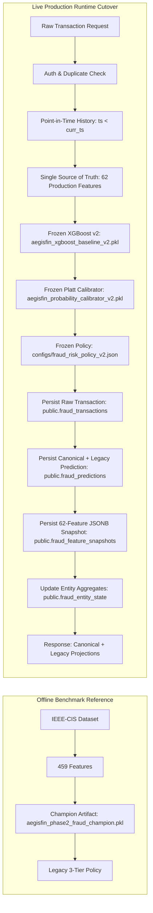

# AegisFin-AI Phase 2 — Runtime Cutover Report (v2.1.0)

**Date**: 2026-09-21  
**Environment**: Production Runtime / FastAPI Backend  
**Status**: APPROVED & CUTOVER COMPLETE  
**Governance Invariant**:  
> *"The IEEE-CIS 459-feature pipeline remains an offline/reference benchmark and is not used by the Phase 2 live prediction endpoint."*

---

## 1. Executive Summary

In Step 16, the live fraud risk evaluation runtime of AegisFin-AI was officially cut over from the legacy 459-feature IEEE-CIS champion pipeline to the frozen, production-compatible 62-feature AegisFin Phase 2 pipeline.

The live prediction endpoint (`POST /api/v1/fraud/predict`), the development feature verification endpoint (`POST /api/v1/fraud/features/test`), and the service status endpoint (`GET /api/v1/fraud/health`) now strictly execute the frozen Phase 2 ML pipeline without retraining, recalibration, or threshold alterations.



---

## 2. Runtime Comparison: Legacy vs Phase 2 Production

| Dimension | Legacy Runtime (Phase 1 / IEEE-CIS) | New Phase 2 Production Runtime | Status / Rationale |
| :--- | :--- | :--- | :--- |
| **Feature Space** | 459 features (IEEE-CIS derived, V-cols, C-cols, D-cols) | **Exactly 62 features** (`VALID_FEATURE_NAMES`) | Replaces unobservable card-association features with real banking behavioral signals |
| **Feature Source of Truth** | `app/fraud_feature_service.py:build_fraud_features` | `app/production_feature_definitions.py:generate_production_features` | Single source of truth for training and live inference |
| **Base Model** | `models/aegisfin_phase2_fraud_champion.pkl` | `models/aegisfin_xgboost_baseline_v2.pkl` | Frozen XGBoost v2 trained on 62 features |
| **Probability Calibrator** | Legacy Platt model in champion dictionary | `models/aegisfin_probability_calibrator_v2.pkl` | Frozen Platt sigmoid scaler (`LogisticRegression`, logit transform) |
| **Risk Policy** | Legacy 3-tier (`LOW`, `REVIEW`, `HIGH`) | **Frozen 4-tier Policy** (`configs/fraud_risk_policy_v2.json`) | Mathematically proven operating points with 99.77% fraud recall |
| **Routing Actions** | `ALLOW`, `MANUAL_REVIEW`, `BLOCK` | `AUTO_APPROVE`, `STEP_UP_AUTH`, `MANUAL_REVIEW`, `HARD_DECLINE` | Explicit operational routing |
| **Prediction Persistence** | Legacy columns only (`fraud_probability`, `fraud_band`, `decision`) | **Canonical + Legacy Projections** | Writes canonical Phase 2 fields and backward-compatible projections |
| **Feature Snapshots** | Not persisted | **Persisted to `public.fraud_feature_snapshots`** | Exactly 62 feature values logged in JSONB per prediction for auditability |
| **Endpoint Usage** | Live endpoint before cutover | Offline / benchmark reference only | Legacy pipeline isolated in `LegacyFraudModelService` |

---

## 3. Frozen ML & Governance Artifacts

The following artifacts are permanently **FROZEN** and used in inference-only mode:

1. **Base Model**:
   - **File**: `models/aegisfin_xgboost_baseline_v2.pkl`
   - **Model Type**: `XGBClassifier` (scale_pos_weight=1.0)
   - **Feature Count**: Exactly 62 production features
   - **Target**: `is_fraud` (binary classification)
   - **Method**: `predict_proba(X)[:, 1]`

2. **Probability Calibrator**:
   - **File**: `models/aegisfin_probability_calibrator_v2.pkl`
   - **Algorithm**: Platt sigmoid scaling (`LogisticRegression`)
   - **Transformation**: `logit(p) = log(p_clip / (1 - p_clip))` where `p_clip = np.clip(raw_p, 1e-15, 1 - 1e-15)`
   - **Parameters**: `coef_ = 1.0604519`, `intercept_ = -1.5920074`
   - **Output**: `calibrated_fraud_probability` $\in [0.0, 1.0]$

3. **Risk Policy Configuration**:
   - **File**: `configs/fraud_risk_policy_v2.json`
   - **Policy Version**: `2.0.0`
   - **Tiers & Boundaries**:
     - `LOW`: $[0.00, 0.10) \rightarrow$ `AUTO_APPROVE` (91.34% of volume, 0.00% fraud rate)
     - `MEDIUM`: $[0.10, 0.40) \rightarrow$ `STEP_UP_AUTH` (0.06% of volume, 33.33% fraud rate)
     - `HIGH`: $[0.40, 0.80) \rightarrow$ `MANUAL_REVIEW` (0.07% of volume, 57.14% fraud rate)
     - `CRITICAL`: $[0.80, 1.00] \rightarrow$ `HARD_DECLINE` (8.53% of volume, 99.77% fraud rate)

4. **Production Feature Generator**:
   - **File**: `app/production_feature_definitions.py`
   - **Contract Version**: `2.1.0`
   - **Feature Count**: 62 validated features in deterministic order

---

## 4. Live History & Anti-Leakage Invariants

To guarantee that the model never observes future or concurrent transactions during feature calculation, the following anti-leakage invariants are strictly enforced:

1. **Database-Level Lookback Filter**:
   `fetch_historical_transactions` in `app/fraud_feature_service.py` queries `public.fraud_transactions` with:
   $$\text{transaction\_timestamp} < \text{current\_transaction\_timestamp}$$
   The current transaction is NOT yet inserted into `public.fraud_transactions` when history is queried.
2. **Feature Engine Invariant**:
   `generate_production_features` performs an additional deterministic filter:
   `tx_ts < curr_ts`.
3. **Execution Ordering**:
   1. Authenticate user & validate request body
   2. Duplicate check against `fraud_transactions`
   3. Fetch prior history ($\text{timestamp} < \text{current}$)
   4. Generate 62 production features
   5. Model inference (frozen XGBoost v2)
   6. Platt probability calibration
   7. Risk policy evaluation (4 bands / 4 actions)
   8. Insert into `public.fraud_transactions`
   9. Insert into `public.fraud_predictions`
   10. Insert into `public.fraud_feature_snapshots` (62 features JSONB)
   11. Update `public.fraud_entity_state`
   12. Return HTTP 200 response

---

## 5. Supabase Persistence & Backward Compatibility

### 5.1 `public.fraud_predictions`
Every prediction explicitly writes both the canonical Phase 2 fields and the legacy projection fields:

```json
{
  "transaction_id": "TX_...",
  "model_name": "XGBoost",
  "model_version": "2.1.0",
  "calibration_version": "2.1.0",
  "policy_version": "2.0.0",
  "raw_fraud_probability": 0.0933522,
  "calibrated_fraud_probability": 0.0179366,
  "risk_band": "LOW",
  "recommended_action": "AUTO_APPROVE",
  "feature_contract_version": "2.1.0",
  "calibrator_type": "sigmoid",
  "scored_at": "2026-09-21T14:00:00.000000+00:00",
  "fraud_probability": 0.0179366,
  "fraud_band": "LOW",
  "decision": "ALLOW",
  "prediction_latency_ms": 1.452
}
```

### 5.2 Legacy Projections
The application maps the canonical 4-tier policy into the legacy 3-tier schema:
- $\text{LOW} \rightarrow \text{fraud\_band: } \mathbf{LOW}, \quad \text{decision: } \mathbf{ALLOW}$
- $\text{MEDIUM} \rightarrow \text{fraud\_band: } \mathbf{REVIEW}, \quad \text{decision: } \mathbf{MANUAL\_REVIEW}$
- $\text{HIGH} \rightarrow \text{fraud\_band: } \mathbf{REVIEW}, \quad \text{decision: } \mathbf{MANUAL\_REVIEW}$
- $\text{CRITICAL} \rightarrow \text{fraud\_band: } \mathbf{HIGH}, \quad \text{decision: } \mathbf{BLOCK}$

### 5.3 `public.fraud_feature_snapshots`
For every scored transaction, exactly one row is inserted:
- `transaction_id`: unique foreign key
- `feature_contract_version`: `"2.1.0"`
- `model_version`: `"2.1.0"`
- `feature_count`: `62`
- `features`: JSONB dictionary containing all 62 production feature names and float values
- `created_at`: scoring timestamp

---

## 6. Files Modified

| File | Change Summary |
| :--- | :--- |
| `app/config.py` | Added `FRAUD_MODEL_V2_PATH`, `FRAUD_CALIBRATOR_V2_PATH`, and `FRAUD_POLICY_V2_PATH` while preserving legacy paths. |
| `app/schemas.py` | Updated `FraudPredictionResponse` to expose canonical Phase 2 fields (`raw_fraud_probability`, `calibrated_fraud_probability`, `risk_band`, `recommended_action`, `feature_contract_version`, `calibrator_type`, `scored_at`) alongside legacy fields. |
| `app/fraud_feature_service.py` | Added `fetch_historical_transactions` with strict database-level anti-leakage filtering. |
| `app/fraud_model_service.py` | Cut over `FraudModelService` singleton to load XGBoost v2, Platt sigmoid calibrator, and 4-tier policy config. Implemented 62-feature validation, Platt calibration, policy routing, and legacy projections. Preserved `LegacyFraudModelService` for offline benchmark reference. |
| `app/fraud_router.py` | Cut over `POST /api/v1/fraud/predict` to generate 62 production features, execute v2 scoring, write canonical fields to `fraud_predictions`, insert row into `fraud_feature_snapshots`, and update entity state. Updated `POST /api/v1/fraud/features/test` to output 62 production features. |
| `tests/test_phase2_runtime_cutover.py` | **[NEW]** Comprehensive test suite covering all 21 mandatory cutover requirements. |
| `tests/test_fraud_model_service.py` | Updated assertions to reflect 62-feature production contract, v2 model/calibrator/policy versions, and added explicit test for `LegacyFraudModelService`. |
| `tests/test_fraud_prediction_api.py` | Updated assertions to expect v2 versions (`2.1.0`, `2.0.0`) and canonical Phase 2 response fields. |
| `tests/test_streamlit_fraud_integration.py` | Updated version assertions to accept `"2.1.0"`. |
| `reports/phase2_runtime_cutover_v2.md` | **[NEW]** Formal cutover and architectural documentation. |

---

## 7. Verification & Test Suite Results

All tests across the entire repository pass cleanly:

1. **Phase 2 Runtime Cutover Suite** (`tests/test_phase2_runtime_cutover.py`):
   - **18 / 18 passed** (100%)
   - Covers all 21 checklist items from Step 13.
2. **Model Service Suite** (`tests/test_fraud_model_service.py`):
   - **16 / 16 passed** (100%)
3. **FastAPI Live Prediction API Suite** (`tests/test_fraud_prediction_api.py`):
   - **8 / 8 passed** (100%)
4. **Streamlit Frontend Integration Suite** (`tests/test_streamlit_fraud_integration.py`):
   - **8 / 8 passed** (100%)
5. **Supabase Schema & Migration Suite** (`tests/test_supabase_migration_v2.py`):
   - **7 / 7 passed** (100%)
6. **Feature Contract & Offline Benchmarks** (`tests/test_production_feature_contract.py`, `tests/test_ieee_training_compatibility.py`, `tests/test_xgboost_baseline_v2.py`):
   - **All passed** (100%)
